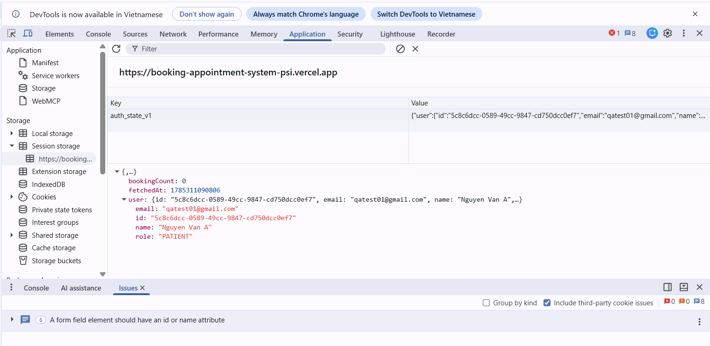
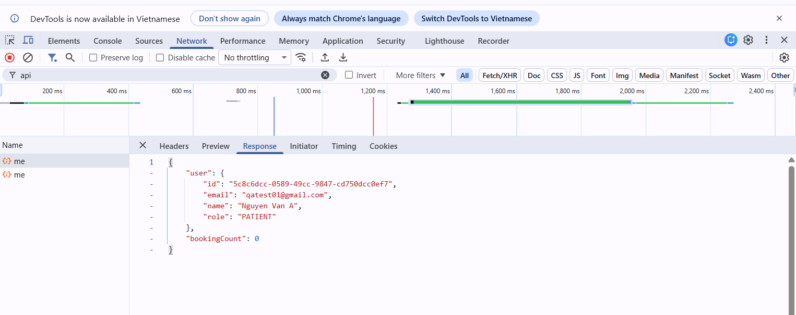
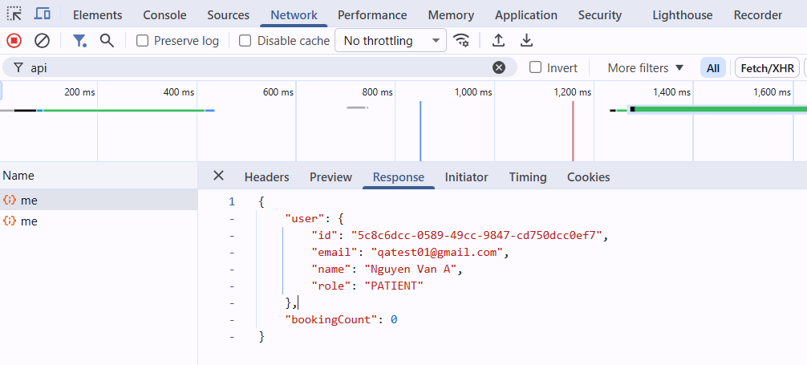
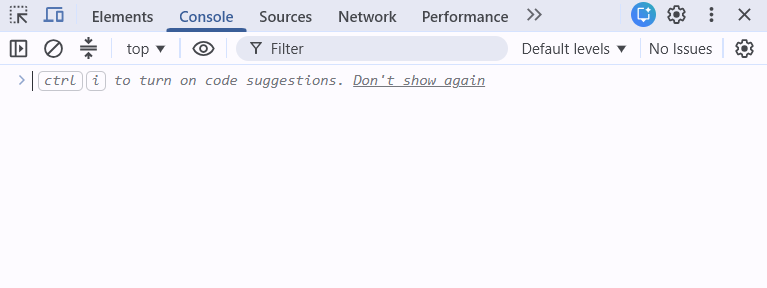
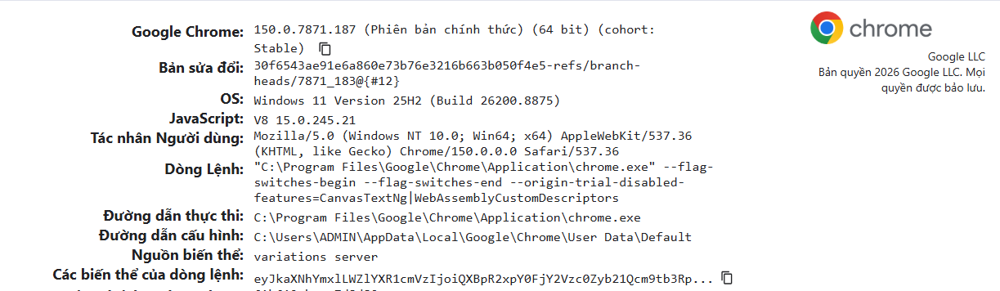

# Hoạt động 1: Human reproduce & Thu thập Evidence

## Bug: [US2-Login] PII (email, họ tên, role) bị lộ dạng plain text trong Session Storage

### A. Steps to Reproduce (reproduce rate: 10/10 lần — luôn xảy ra) 
1. Mở Chrome (Incognito), vào `https://booking-appointment-system-psi.vercel.app/auth/register`
2. Đăng ký tài khoản mới:
   - Họ tên: Nguyen Van A
   - Email: qatest01@gmail.com
   - Password: Test@123
3. Đăng nhập bằng tài khoản vừa tạo
4. Mở F12 → Application → Session Storage → domain của web
5. → Thấy ngay key `auth_state_v1` chứa toàn bộ PII dạng plain text, không mã hóa

### B. Session Storage Evidence 

**Key:** `auth_state_v1`  
**Value:**
```json
{
  "user": {
    "id": "5c8c6dcc-0589-49cc-9847-cd750dcc0ef7",
    "email": "qatest01@gmail.com",
    "name": "Nguyen Van A",
    "role": "PATIENT"
  },
  "bookingCount": 0,
  "fetchedAt": 1785311090806
}
```


*→ Toàn bộ đọc được trực tiếp bằng mắt thường, không mã hóa/encode.*

### C. Network Request/Response (nguồn gốc dữ liệu) 

```http
GET /bookings/me HTTP/1.1
Host: booking-appointment-system-psi.vercel.app
Status: 200 OK
```

**Response:** 
```json
{
  "user": {
    "id": "5c8c6dcc-0589-49cc-9847-cd750dcc0ef7",
    "email": "qatest01@gmail.com",
    "name": "Nguyen Van A",
    "role": "PATIENT"
  },
  "bookingCount": 0
}
```




*→ Backend trả PII trực tiếp trong response, frontend lưu nguyên văn vào sessionStorage không qua mã hóa/lọc field nhạy cảm nào.*

### D. Browser Console Log

Console trống, "No Issues" — không có error/warning nào khi load trang và session được lưu.  



*→ Xác nhận: việc lưu PII plain text vào sessionStorage KHÔNG phải do lỗi runtime/crash, mà là hành vi thiết kế của ứng dụng (frontend chủ động lưu nguyên response API `GET /bookings/me` vào sessionStorage mà không lọc/mã hóa field nhạy cảm).*

### E. Môi trường 

* **App:** Booking Appointment System (Next.js + PostgreSQL), staging - Vercel
* **URL:** [https://booking-appointment-system-psi.vercel.app](https://booking-appointment-system-psi.vercel.app)
* **Browser:** Google Chrome 150.0.7871.187 (64-bit)
* **OS:** Windows 11, Version 25H2 (Build 26200.8875)
* **Thời gian test:** 29/07/2026



### F. Ẩn danh dữ liệu

**Tất cả các thông tin cá nhân của người dùng phải được che dấu, ẩn đi**

**Key:** `auth_state_v1`  
**Value:**
```json
{
  "user": {
    "id": "«REDACTED_ID»",
    "email": "«REDACTED_EMAIL»",
    "name": "«REDACTED_NAME»",
    "role": "PATIENT"
  },
  "bookingCount": 0,
  "fetchedAt": 1785311090806
}
```

```http
GET /bookings/me HTTP/1.1
Host: booking-appointment-system-psi.vercel.app
Status: 200 OK
```

**Response:** 
```json
{
  "user": {
    "id": "«REDACTED_ID»",
    "email": "«REDACTED_EMAIL»",
    "name": "«REDACTED_NAME»",
    "role": "PATIENT"
  },
  "bookingCount": 0
}
```

